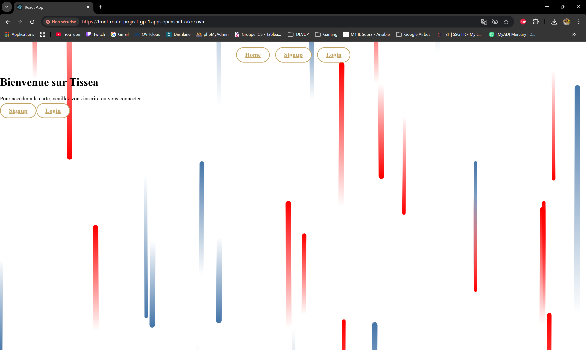

# 🚀 Déploiement de l'application Express-Tissea sur OpenShift
Yannick/Mathias
## 🎯 Objectif

Déployer l'application **Express-Tissea** composée :

* d’un frontend React
* d’un backend Express.js
* d’une base SQLite persistée via NFS
* d’images hébergées sur Harbor
* d’un déploiement complet sur OpenShift (Deployments, Services, Route)
* d’une communication fonctionnelle entre Front et Back

---

# Prérequis

* Docker installé
* Accès Harbor : harbor.kakor.ovh
* Accès OpenShift
* Namespace OpenShift : project-gp-1
* Serveur NFS :
  192.168.1.56:/Volume1/public/nfs-share-openshift/project-gp-1

---

# Connexion OpenShift

```bash
oc login <url-openshift>
oc project project-gp-1
```

---

# Connexion Harbor

```bash
docker login harbor.kakor.ovh
```

---

# Construction et push des images Docker

## 🔹 Backend

Depuis la racine du projet Express-Tissea :

```bash
docker build -t harbor.kakor.ovh/ipi/gp-1-back .
docker push harbor.kakor.ovh/ipi/gp-1-back
```

## 🔹 Frontend

```bash
cd frontend
docker build -t harbor.kakor.ovh/ipi/gp-1-front .
docker push harbor.kakor.ovh/ipi/gp-1-front
cd ..
```

---

# Déploiement du stockage persistant (NFS)

Fichiers utilisés dans le dossier `k8s/` :

* pv.yaml
* pvc.yaml

Application :

```bash
oc apply -f k8s/pv.yaml
oc apply -f k8s/pvc.yaml
```

Vérification :

```bash
oc get pvc
```

Le statut doit être : **Bound**

---

# Déploiement Backend

Fichiers :

* k8s/back-deployment.yaml
* k8s/back-service.yaml

Application :

```bash
oc apply -f k8s/back-deployment.yaml
oc apply -f k8s/back-service.yaml
```

Vérification :

```bash
oc get pods
```

Le pod backend doit être : **Running**

---

# Déploiement Frontend

Fichiers :

* k8s/front-deployment.yaml
* k8s/front-service.yaml

Application :

```bash
oc apply -f k8s/front-deployment.yaml
oc apply -f k8s/front-service.yaml
```

---

# Création de la Route OpenShift (TLS Edge)

Fichier :

* k8s/route.yaml

Application :

```bash
oc apply -f k8s/route.yaml
```

Vérification :

```bash
oc get route
```

Une URL publique doit être générée.

---

# Vérification complète du déploiement

```bash
oc get pods
oc get svc
oc get pvc
oc get route
```

Résultats attendus :

* Pods : Running
* PVC : Bound
* Services : actifs
* Route : accessible

---

# Vérification communication Front ↔ Back

## Test interne cluster

```bash
oc rsh deploy/back-deployment
wget -qO- http://back-service:5000
```

Réponse attendue :

```
API is running...
```

## Test navigateur

Ouvrir :

```
https://front-route-project-gp-1.apps.openshift.kakor.ovh
```

* Problème d'inscription

---

# 📦 Livrables

* README.md
* Dockerfile backend
* Dockerfile frontend
* Dossier k8s/ complet
* Capture écran de l'application
* Schéma Draw.io
* https://github.com/ThMaths/kubernetes

# Capture d'écran



# Schéma Draw.io


